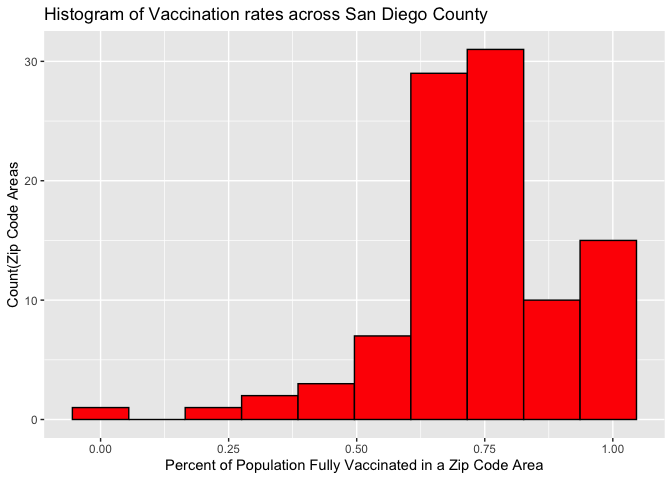
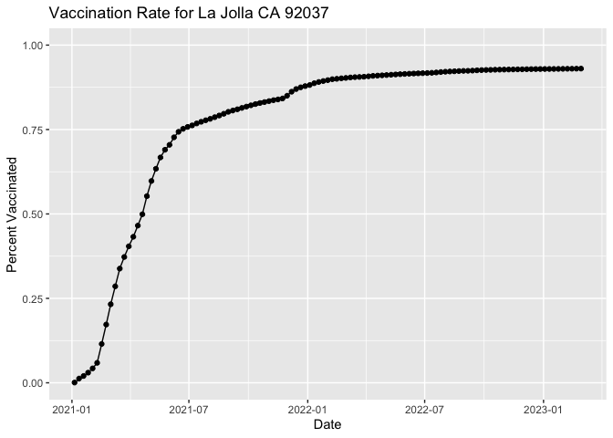
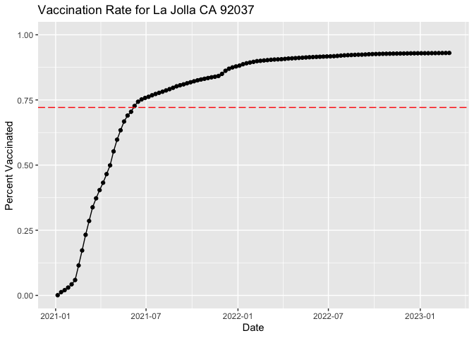
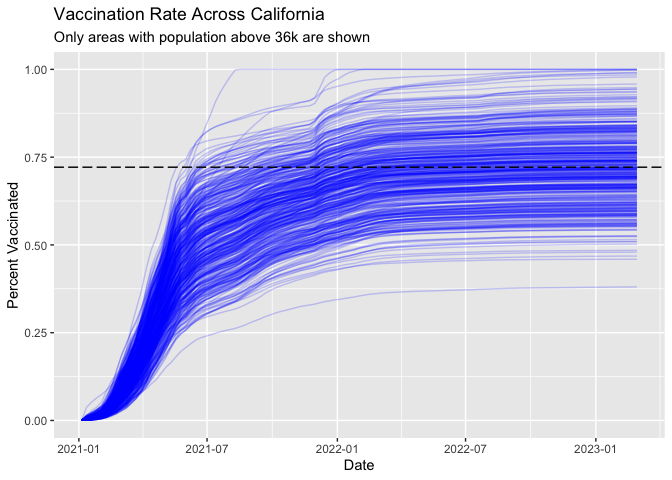

Class17 Vaccination Mini Project
================
Eduardo Modolo

``` r
# Import vaccination data
vax <- read.csv( "covid19vaccinesbyzipcode_test.csv" )
head(vax)
```

      as_of_date zip_code_tabulation_area local_health_jurisdiction    county
    1 2021-01-05                    95446                    Sonoma    Sonoma
    2 2021-01-05                    96014                  Siskiyou  Siskiyou
    3 2021-01-05                    96087                    Shasta    Shasta
    4 2021-01-05                    96008                    Shasta    Shasta
    5 2021-01-05                    95410                 Mendocino Mendocino
    6 2021-01-05                    95527                   Trinity   Trinity
      vaccine_equity_metric_quartile                 vem_source
    1                              2 Healthy Places Index Score
    2                              2    CDPH-Derived ZCTA Score
    3                              2    CDPH-Derived ZCTA Score
    4                             NA            No VEM Assigned
    5                              3    CDPH-Derived ZCTA Score
    6                              2    CDPH-Derived ZCTA Score
      age12_plus_population age5_plus_population tot_population
    1                4840.7                 5057           5168
    2                 135.0                  135            135
    3                 513.9                  544            544
    4                1125.3                 1164             NA
    5                 926.3                  988            997
    6                 476.6                  485            499
      persons_fully_vaccinated persons_partially_vaccinated
    1                       NA                           NA
    2                       NA                           NA
    3                       NA                           NA
    4                       NA                           NA
    5                       NA                           NA
    6                       NA                           NA
      percent_of_population_fully_vaccinated
    1                                     NA
    2                                     NA
    3                                     NA
    4                                     NA
    5                                     NA
    6                                     NA
      percent_of_population_partially_vaccinated
    1                                         NA
    2                                         NA
    3                                         NA
    4                                         NA
    5                                         NA
    6                                         NA
      percent_of_population_with_1_plus_dose booster_recip_count
    1                                     NA                  NA
    2                                     NA                  NA
    3                                     NA                  NA
    4                                     NA                  NA
    5                                     NA                  NA
    6                                     NA                  NA
      bivalent_dose_recip_count eligible_recipient_count
    1                        NA                        0
    2                        NA                        0
    3                        NA                        2
    4                        NA                        2
    5                        NA                        0
    6                        NA                        0
                                                                   redacted
    1 Information redacted in accordance with CA state privacy requirements
    2 Information redacted in accordance with CA state privacy requirements
    3 Information redacted in accordance with CA state privacy requirements
    4 Information redacted in accordance with CA state privacy requirements
    5 Information redacted in accordance with CA state privacy requirements
    6 Information redacted in accordance with CA state privacy requirements

> Q1. What column details the total number of people fully vaccinated ?

vax\$persons_fully_vaccinated

> Q2. What column details the Zip code tabulation area?

vax\$zip_code_tabulation_area

> Q3. What is the earliest date in this dataset ?

``` r
head(sort(vax$as_of_date))
```

    [1] "2021-01-05" "2021-01-05" "2021-01-05" "2021-01-05" "2021-01-05"
    [6] "2021-01-05"

earliest is Jan 5th 2021

> Q4. What is the latest date in this dataset?

``` r
head(sort(vax$as_of_date, decreasing = TRUE))
```

    [1] "2023-02-28" "2023-02-28" "2023-02-28" "2023-02-28" "2023-02-28"
    [6] "2023-02-28"

latest is feb 28th 2023

``` r
skimr::skim(vax)
```

|                                                  |        |
|:-------------------------------------------------|:-------|
| Name                                             | vax    |
| Number of rows                                   | 199332 |
| Number of columns                                | 18     |
| \_\_\_\_\_\_\_\_\_\_\_\_\_\_\_\_\_\_\_\_\_\_\_   |        |
| Column type frequency:                           |        |
| character                                        | 5      |
| numeric                                          | 13     |
| \_\_\_\_\_\_\_\_\_\_\_\_\_\_\_\_\_\_\_\_\_\_\_\_ |        |
| Group variables                                  | None   |

Data summary

**Variable type: character**

| skim_variable             | n_missing | complete_rate | min | max | empty | n_unique | whitespace |
|:--------------------------|----------:|--------------:|----:|----:|------:|---------:|-----------:|
| as_of_date                |         0 |             1 |  10 |  10 |     0 |      113 |          0 |
| local_health_jurisdiction |         0 |             1 |   0 |  15 |   565 |       62 |          0 |
| county                    |         0 |             1 |   0 |  15 |   565 |       59 |          0 |
| vem_source                |         0 |             1 |  15 |  26 |     0 |        3 |          0 |
| redacted                  |         0 |             1 |   2 |  69 |     0 |        2 |          0 |

**Variable type: numeric**

| skim_variable                              | n_missing | complete_rate |     mean |       sd |    p0 |      p25 |      p50 |      p75 |     p100 | hist  |
|:-------------------------------------------|----------:|--------------:|---------:|---------:|------:|---------:|---------:|---------:|---------:|:------|
| zip_code_tabulation_area                   |         0 |          1.00 | 93665.11 |  1817.38 | 90001 | 92257.75 | 93658.50 | 95380.50 |  97635.0 | ▃▅▅▇▁ |
| vaccine_equity_metric_quartile             |      9831 |          0.95 |     2.44 |     1.11 |     1 |     1.00 |     2.00 |     3.00 |      4.0 | ▇▇▁▇▇ |
| age12_plus_population                      |         0 |          1.00 | 18895.04 | 18993.87 |     0 |  1346.95 | 13685.10 | 31756.12 |  88556.7 | ▇▃▂▁▁ |
| age5_plus_population                       |         0 |          1.00 | 20875.24 | 21105.97 |     0 |  1460.50 | 15364.00 | 34877.00 | 101902.0 | ▇▃▂▁▁ |
| tot_population                             |      9718 |          0.95 | 23372.77 | 22628.51 |    12 |  2126.00 | 18714.00 | 38168.00 | 111165.0 | ▇▅▂▁▁ |
| persons_fully_vaccinated                   |     16525 |          0.92 | 13962.33 | 15054.09 |    11 |   930.00 |  8566.00 | 23302.00 |  87566.0 | ▇▃▁▁▁ |
| persons_partially_vaccinated               |     16525 |          0.92 |  1701.64 |  2030.18 |    11 |   165.00 |  1196.00 |  2535.00 |  39913.0 | ▇▁▁▁▁ |
| percent_of_population_fully_vaccinated     |     20825 |          0.90 |     0.57 |     0.25 |     0 |     0.42 |     0.60 |     0.74 |      1.0 | ▂▃▆▇▃ |
| percent_of_population_partially_vaccinated |     20825 |          0.90 |     0.08 |     0.09 |     0 |     0.05 |     0.06 |     0.08 |      1.0 | ▇▁▁▁▁ |
| percent_of_population_with_1\_plus_dose    |     21859 |          0.89 |     0.63 |     0.24 |     0 |     0.49 |     0.67 |     0.81 |      1.0 | ▂▂▅▇▆ |
| booster_recip_count                        |     72872 |          0.63 |  5837.31 |  7165.81 |    11 |   297.00 |  2748.00 |  9438.25 |  59553.0 | ▇▂▁▁▁ |
| bivalent_dose_recip_count                  |    158664 |          0.20 |  2924.93 |  3583.45 |    11 |   190.00 |  1418.00 |  4626.25 |  27458.0 | ▇▂▁▁▁ |
| eligible_recipient_count                   |         0 |          1.00 | 12801.84 | 14908.33 |     0 |   504.00 |  6338.00 | 21973.00 |  87234.0 | ▇▃▁▁▁ |

> Q5. How many numeric columns are in this dataset?

13 numeric columns

> Q6. Note that there are “missing values” in the dataset. How many NA
> values there in the persons_fully_vaccinated column?

``` r
sum(is.na(vax$persons_fully_vaccinated))
```

    [1] 16525

you can also look at the skim table

> Q7. What percent of persons_fully_vaccinated values are missing (to 2
> significant figures)?

``` r
length(vax$persons_fully_vaccinated)
```

    [1] 199332

``` r
round(sum(is.na(vax$persons_fully_vaccinated)) / length(vax$persons_fully_vaccinated) * 100, 2)
```

    [1] 8.29

> Q8. \[Optional\]: Why might this data be missing?

some groups of people refuse to give vaccination information, such as
military bases and stuff

\##Working with dates

``` r
library(lubridate)
```


    Attaching package: 'lubridate'

    The following objects are masked from 'package:base':

        date, intersect, setdiff, union

``` r
today()
```

    [1] "2023-03-16"

``` r
# This will give an Error!
#today() - vax$as_of_date[1]
```

``` r
# Specify that we are using the year-month-day format
vax$as_of_date <- ymd(vax$as_of_date)
```

``` r
today() - vax$as_of_date[1]
```

    Time difference of 800 days

how old I am in days

``` r
today() - ymd("2000-11-05")
```

    Time difference of 8166 days

how old I am in seconds

``` r
24*60*60*8157
```

    [1] 704764800

How old Avery is in days

``` r
today() - ymd("2001-07-28")
```

    Time difference of 7901 days

> Q9. How many days have passed since the last update of the dataset?

``` r
today() - vax$as_of_date[nrow(vax)]
```

    Time difference of 16 days

> Q10. How many unique dates are in the dataset (i.e. how many different
> dates are detailed)?

``` r
length(unique(vax$as_of_date))
```

    [1] 113

``` r
library(dplyr)
```


    Attaching package: 'dplyr'

    The following objects are masked from 'package:stats':

        filter, lag

    The following objects are masked from 'package:base':

        intersect, setdiff, setequal, union

``` r
n_distinct(vax$as_of_date)
```

    [1] 113

\##Working With ZIP Codes

``` r
library(zipcodeR)
geocode_zip('92037')
```

    # A tibble: 1 × 3
      zipcode   lat   lng
      <chr>   <dbl> <dbl>
    1 92037    32.8 -117.

``` r
zip_distance('92037','92109')
```

      zipcode_a zipcode_b distance
    1     92037     92109     2.33

``` r
reverse_zipcode(c('92037', "92109") )
```

    # A tibble: 2 × 24
      zipcode zipcode_…¹ major…² post_…³ common_c…⁴ county state   lat   lng timez…⁵
      <chr>   <chr>      <chr>   <chr>       <blob> <chr>  <chr> <dbl> <dbl> <chr>  
    1 92037   Standard   La Jol… La Jol… <raw 20 B> San D… CA     32.8 -117. Pacific
    2 92109   Standard   San Di… San Di… <raw 21 B> San D… CA     32.8 -117. Pacific
    # … with 14 more variables: radius_in_miles <dbl>, area_code_list <blob>,
    #   population <int>, population_density <dbl>, land_area_in_sqmi <dbl>,
    #   water_area_in_sqmi <dbl>, housing_units <int>,
    #   occupied_housing_units <int>, median_home_value <int>,
    #   median_household_income <int>, bounds_west <dbl>, bounds_east <dbl>,
    #   bounds_north <dbl>, bounds_south <dbl>, and abbreviated variable names
    #   ¹​zipcode_type, ²​major_city, ³​post_office_city, ⁴​common_city_list, …

``` r
zip_distance('92037','95765')
```

      zipcode_a zipcode_b distance
    1     92037     95765   474.82

``` r
geocode_zip('95765')
```

    # A tibble: 1 × 3
      zipcode   lat   lng
      <chr>   <dbl> <dbl>
    1 95765    38.8 -121.

\#Focus on the San Diego area

``` r
# Subset to San Diego county only areas
sd <- vax[ vax$county == "San Diego" , ]
```

``` r
head(sd)
```

        as_of_date zip_code_tabulation_area local_health_jurisdiction    county
    365 2021-01-05                    92040                 San Diego San Diego
    389 2021-01-05                    92154                 San Diego San Diego
    391 2021-01-05                    92122                 San Diego San Diego
    393 2021-01-05                    92120                 San Diego San Diego
    396 2021-01-05                    92115                 San Diego San Diego
    398 2021-01-05                    92114                 San Diego San Diego
        vaccine_equity_metric_quartile                 vem_source
    365                              3 Healthy Places Index Score
    389                              2 Healthy Places Index Score
    391                              4 Healthy Places Index Score
    393                              4 Healthy Places Index Score
    396                              2 Healthy Places Index Score
    398                              2 Healthy Places Index Score
        age12_plus_population age5_plus_population tot_population
    365               39405.0                42833          46306
    389               76365.2                82971          88979
    391               44091.1                45951          48071
    393               26372.9                28414          30550
    396               56152.4                60409          64343
    398               59050.7                64945          68851
        persons_fully_vaccinated persons_partially_vaccinated
    365                       14                          585
    389                       16                         1397
    391                       19                         1249
    393                       25                          906
    396                       28                          874
    398                       12                         1213
        percent_of_population_fully_vaccinated
    365                               0.000302
    389                               0.000180
    391                               0.000395
    393                               0.000818
    396                               0.000435
    398                               0.000174
        percent_of_population_partially_vaccinated
    365                                   0.012633
    389                                   0.015700
    391                                   0.025982
    393                                   0.029656
    396                                   0.013583
    398                                   0.017618
        percent_of_population_with_1_plus_dose booster_recip_count
    365                               0.012935                  NA
    389                               0.015880                  NA
    391                               0.026377                  NA
    393                               0.030474                  NA
    396                               0.014018                  NA
    398                               0.017792                  NA
        bivalent_dose_recip_count eligible_recipient_count
    365                        NA                       14
    389                        NA                       16
    391                        NA                       19
    393                        NA                       25
    396                        NA                       28
    398                        NA                       12
                                                                     redacted
    365 Information redacted in accordance with CA state privacy requirements
    389 Information redacted in accordance with CA state privacy requirements
    391 Information redacted in accordance with CA state privacy requirements
    393 Information redacted in accordance with CA state privacy requirements
    396 Information redacted in accordance with CA state privacy requirements
    398 Information redacted in accordance with CA state privacy requirements

``` r
nrow(sd)
```

    [1] 12091

``` r
library(dplyr)

sd <- filter(vax, county == "San Diego")

nrow(sd)
```

    [1] 12091

Use dplyr to filter for population \> 10,000

``` r
sd.10 <- filter(vax, county == "San Diego" &
                age5_plus_population > 10000)
nrow(sd.10)
```

    [1] 8588

> Q11. How many distinct zip codes are listed for San Diego County?

``` r
n_distinct(sd$zip_code_tabulation_area)
```

    [1] 107

> Q12. What San Diego County Zip code area has the largest 12 +
> Population in this dataset?

``` r
sd$zip_code_tabulation_area[which.max(sd$age12_plus_population)]
```

    [1] 92154

> Q13. What is the overall average “Percent of Population Fully
> Vaccinated” value for all San Diego “County” as of last entry
> “2023-02-28”?

``` r
 x <- filter(sd, as_of_date == "2023-02-28")
head(x)
```

      as_of_date zip_code_tabulation_area local_health_jurisdiction    county
    1 2023-02-28                    91980                 San Diego San Diego
    2 2023-02-28                    91963                 San Diego San Diego
    3 2023-02-28                    92173                 San Diego San Diego
    4 2023-02-28                    92154                 San Diego San Diego
    5 2023-02-28                    92078                 San Diego San Diego
    6 2023-02-28                    92123                 San Diego San Diego
      vaccine_equity_metric_quartile                 vem_source
    1                             NA            No VEM Assigned
    2                              2    CDPH-Derived ZCTA Score
    3                              1 Healthy Places Index Score
    4                              2 Healthy Places Index Score
    5                              3 Healthy Places Index Score
    6                              3 Healthy Places Index Score
      age12_plus_population age5_plus_population tot_population
    1                   0.0                    0             NA
    2                1010.3                 1089           1182
    3               25332.5                28487          31000
    4               76365.2                82971          88979
    5               41789.5                47476          50510
    6               28353.3                30426          32473
      persons_fully_vaccinated persons_partially_vaccinated
    1                     1968                          672
    2                     1204                          175
    3                    56448                        37233
    4                    87566                        19638
    5                    36673                         2992
    6                    29884                         3737
      percent_of_population_fully_vaccinated
    1                               1.000000
    2                               1.000000
    3                               1.000000
    4                               0.984120
    5                               0.726054
    6                               0.920272
      percent_of_population_partially_vaccinated
    1                                   1.000000
    2                                   0.148054
    3                                   1.000000
    4                                   0.220704
    5                                   0.059236
    6                                   0.115080
      percent_of_population_with_1_plus_dose booster_recip_count
    1                                     NA                 863
    2                                1.00000                 584
    3                                1.00000               27100
    4                                1.00000               48030
    5                                0.78529               23557
    6                                1.00000               19673
      bivalent_dose_recip_count eligible_recipient_count redacted
    1                       198                     1962       No
    2                       135                     1202       No
    3                      6603                    56212       No
    4                     12970                    87234       No
    5                      9495                    36526       No
    6                      7561                    29717       No

``` r
mean(x$percent_of_population_fully_vaccinated, na.rm = TRUE) * 100
```

    [1] 74.00878

average percentage is 74.01%

> Q14. Using either ggplot or base R graphics make a summary figure that
> shows the distribution of Percent of Population Fully Vaccinated
> values as of “2023-02-28”?

``` r
library(ggplot2)
ggplot(x, aes(percent_of_population_fully_vaccinated)) + geom_histogram(bins = 10, na.rm= T, color= "black", fill = "red") + ggtitle("Histogram of Vaccination rates across San Diego County") + xlab("Percent of Population Fully Vaccinated in a Zip Code Area") + ylab("Count(Zip Code Areas")
```



\##Focus on UCSD/La Jolla

``` r
ucsd <- filter(sd, zip_code_tabulation_area=="92037")
ucsd[1,]$age5_plus_population
```

    [1] 36144

> Q15. Using ggplot make a graph of the vaccination rate time course for
> the 92037 ZIP code area:

``` r
ggplot(ucsd) +
  aes(as_of_date, percent_of_population_fully_vaccinated) +
  geom_point() +
  geom_line(group=1) +
  ylim(c(0,1)) +
  labs(title = "Vaccination Rate for La Jolla CA 92037", x= "Date", y="Percent Vaccinated") 
```



\##Comparing to similar sized areas

``` r
# Subset to all CA areas with a population as large as 92037
vax.36 <- filter(vax, age5_plus_population > 36144 &
                as_of_date == "2023-02-28")

head(vax.36)
```

      as_of_date zip_code_tabulation_area local_health_jurisdiction      county
    1 2023-02-28                    93257                    Tulare      Tulare
    2 2023-02-28                    93535               Los Angeles Los Angeles
    3 2023-02-28                    91367               Los Angeles Los Angeles
    4 2023-02-28                    90025               Los Angeles Los Angeles
    5 2023-02-28                    90024               Los Angeles Los Angeles
    6 2023-02-28                    90031               Los Angeles Los Angeles
      vaccine_equity_metric_quartile                 vem_source
    1                              1 Healthy Places Index Score
    2                              1 Healthy Places Index Score
    3                              3 Healthy Places Index Score
    4                              4 Healthy Places Index Score
    5                              3 Healthy Places Index Score
    6                              1 Healthy Places Index Score
      age12_plus_population age5_plus_population tot_population
    1               61519.8                70784          76519
    2               59042.7                68471          74264
    3               40437.4                43398          45970
    4               42803.2                44982          46883
    5               48841.8                50198          51627
    6               34503.3                37735          39916
      persons_fully_vaccinated persons_partially_vaccinated
    1                    45104                         5629
    2                    45338                         4907
    3                    33648                         2948
    4                    36156                         4530
    5                    28005                         5788
    6                    29270                         3186
      percent_of_population_fully_vaccinated
    1                               0.589448
    2                               0.610498
    3                               0.731956
    4                               0.771196
    5                               0.542449
    6                               0.733290
      percent_of_population_partially_vaccinated
    1                                   0.073563
    2                                   0.066075
    3                                   0.064129
    4                                   0.096624
    5                                   0.112112
    6                                   0.079818
      percent_of_population_with_1_plus_dose booster_recip_count
    1                               0.663011               22106
    2                               0.676573               21799
    3                               0.796085               22052
    4                               0.867820               25207
    5                               0.654561               19239
    6                               0.813108               17344
      bivalent_dose_recip_count eligible_recipient_count redacted
    1                      4981                    45046       No
    2                      6754                    45247       No
    3                      9234                    33544       No
    4                     12099                    35980       No
    5                      8578                    27934       No
    6                      6076                    29213       No

> Q16. Calculate the mean “Percent of Population Fully Vaccinated” for
> ZIP code areas with a population as large as 92037 (La Jolla)
> as_of_date “2023-02-28”. Add this as a straight horizontal line to
> your plot from above with the geom_hline() function?

``` r
mean(vax.36$percent_of_population_fully_vaccinated)
```

    [1] 0.7213331

``` r
ggplot(ucsd) +
  aes(as_of_date, percent_of_population_fully_vaccinated) +
  geom_point() +
  geom_line(group=1) +
  ylim(c(0,1)) +
  labs(title = "Vaccination Rate for La Jolla CA 92037", x= "Date", y="Percent Vaccinated") + geom_hline(yintercept = 0.7213331, color = "red", linetype = 5)
```



> Q17. What is the 6 number summary (Min, 1st Qu., Median, Mean, 3rd
> Qu., and Max) of the “Percent of Population Fully Vaccinated” values
> for ZIP code areas with a population as large as 92037 (La Jolla)
> as_of_date “2023-02-28”?

``` r
summary(vax.36$percent_of_population_fully_vaccinated)
```

       Min. 1st Qu.  Median    Mean 3rd Qu.    Max. 
     0.3804  0.6457  0.7181  0.7213  0.7907  1.0000 

> Q18. Using ggplot generate a histogram of this data.

``` r
ggplot(vax.36) +aes(percent_of_population_fully_vaccinated) +geom_histogram(col= "white", fill = "Black", na.rm = TRUE) + xlim(0,1) 
```

    `stat_bin()` using `bins = 30`. Pick better value with `binwidth`.


> Q19. Is the 92109 and 92040 ZIP code areas above or below the average
> value you calculated for all these above?

``` r
x <- filter(vax.36, zip_code_tabulation_area %in% c("92109", "92040"))
x$percent_of_population_fully_vaccinated
```

    [1] 0.694572 0.550296

below the mean of 0.7213

> Q20. Finally make a time course plot of vaccination progress for all
> areas in the full dataset with a age5_plus_population \> 36144.

``` r
vax.36.all <- filter(vax, age5_plus_population > 36144)


ggplot(vax.36.all) +
  aes(as_of_date,
      percent_of_population_fully_vaccinated, 
      group=zip_code_tabulation_area) +
  geom_line(alpha=0.2, color="Blue", na.rm = TRUE) +
  ylim(0,1) +
  labs(x="Date", y="Percent Vaccinated",
       title="Vaccination Rate Across California",
       subtitle="Only areas with population above 36k are shown") +
  geom_hline(yintercept = 0.7213331, linetype=5)
```


