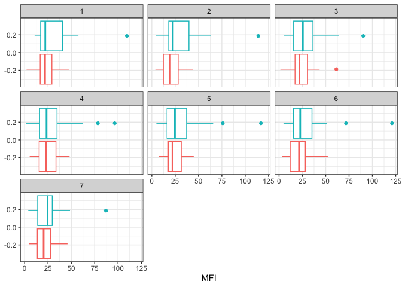

Class19 Mini-project
================
Eduardo Modolo

\#Investigating pertussis cases by year

The CDC records the number of cases per year from 1922 to 2019

> Q1. With the help of the R “addin” package datapasta assign the CDC
> pertussis case number data to a data frame called cdc and use ggplot
> to make a plot of cases numbers over time.

use addins -\> data.frame and your data copied to your clipboard will
show up as a dataframe

``` r
library(datapasta)
cdc <- data.frame(
                                             Year = c(1922L,1923L,1924L,
                                                      1925L,1926L,1927L,1928L,
                                                      1929L,1930L,1931L,
                                                      1932L,1933L,1934L,1935L,
                                                      1936L,1937L,1938L,1939L,
                                                      1940L,1941L,1942L,
                                                      1943L,1944L,1945L,1946L,
                                                      1947L,1948L,1949L,1950L,
                                                      1951L,1952L,1953L,1954L,
                                                      1955L,1956L,1957L,
                                                      1958L,1959L,1960L,1961L,
                                                      1962L,1963L,1964L,1965L,
                                                      1966L,1967L,1968L,
                                                      1969L,1970L,1971L,1972L,
                                                      1973L,1974L,1975L,1976L,
                                                      1977L,1978L,1979L,1980L,
                                                      1981L,1982L,1983L,
                                                      1984L,1985L,1986L,1987L,
                                                      1988L,1989L,1990L,1991L,
                                                      1992L,1993L,1994L,
                                                      1995L,1996L,1997L,1998L,
                                                      1999L,2000L,2001L,2002L,
                                                      2003L,2004L,2005L,2006L,
                                                      2007L,2008L,2009L,
                                                      2010L,2011L,2012L,2013L,
                                                      2014L,2015L,2016L,2017L,
                                                      2018L,2019L),
                     Cases = c(107473,164191,
                                                      165418,152003,202210,181411,
                                                      161799,197371,166914,
                                                      172559,215343,179135,
                                                      265269,180518,147237,
                                                      214652,227319,103188,183866,
                                                      222202,191383,191890,
                                                      109873,133792,109860,
                                                      156517,74715,69479,120718,
                                                      68687,45030,37129,
                                                      60886,62786,31732,28295,
                                                      32148,40005,14809,11468,
                                                      17749,17135,13005,6799,
                                                      7717,9718,4810,3285,
                                                      4249,3036,3287,1759,
                                                      2402,1738,1010,2177,2063,
                                                      1623,1730,1248,1895,
                                                      2463,2276,3589,4195,
                                                      2823,3450,4157,4570,2719,
                                                      4083,6586,4617,5137,
                                                      7796,6564,7405,7298,
                                                      7867,7580,9771,11647,
                                                      25827,25616,15632,10454,
                                                      13278,16858,27550,18719,
                                                      48277,28639,32971,20762,
                                                      17972,18975,15609,
                                                      18617)
                   )
```

``` r
library(ggplot2)
base <- ggplot(cdc) +
  aes(Year, Cases) +
  geom_point() +
  geom_line() +
  labs(x= "Year", y= "Number of Cases", title = "Pertussis Cases by Year (1922-2019)", subtitle = "Data from the CDC")
base
```


> Q2. Using the ggplot geom_vline() function add lines to your previous
> plot for the 1946 introduction of the wP vaccine and the 1996 switch
> to aP vaccine (see example in the hint below). What do you notice?

``` r
base + geom_vline(xintercept= 1946, col = "blue", linetype=5) + geom_vline(xintercept = 1996, col= "red", linetype= 5)
```


> Q3. Describe what happened after the introduction of the aP vaccine?
> Do you have a possible explanation for the observed trend?

After the introduction of the aP vaccine, the numbers remained low for a
little and then we see spikes in cases. The aP vaccine appears to not be
as effective, as the number of cases after the switch from wP to aP
appears to start rising. It could also be people are more hesitant to
getting vaccines.

\#The CMI-Project

has been collecting data on aP and wP individuals and their immune
response to infection and or booster shots

CMI-PB returns data from it’s API in JSON format and we will use
jsonlite to get data from this API

``` r
library(jsonlite)
```

``` r
subject <- read_json("http://cmi-pb.org/api/subject", simplifyVector = TRUE)
head(subject)
```

      subject_id infancy_vac biological_sex              ethnicity  race
    1          1          wP         Female Not Hispanic or Latino White
    2          2          wP         Female Not Hispanic or Latino White
    3          3          wP         Female                Unknown White
    4          4          wP           Male Not Hispanic or Latino Asian
    5          5          wP           Male Not Hispanic or Latino Asian
    6          6          wP         Female Not Hispanic or Latino White
      year_of_birth date_of_boost      dataset
    1    1986-01-01    2016-09-12 2020_dataset
    2    1968-01-01    2019-01-28 2020_dataset
    3    1983-01-01    2016-10-10 2020_dataset
    4    1988-01-01    2016-08-29 2020_dataset
    5    1991-01-01    2016-08-29 2020_dataset
    6    1988-01-01    2016-10-10 2020_dataset

> Q4. How may aP and wP infancy vaccinated subjects are in the dataset?

``` r
table(subject$infancy_vac)
```


    aP wP 
    47 49 

> Q5. How many Male and Female subjects/patients are in the dataset?

``` r
table(subject$biological_sex)
```


    Female   Male 
        66     30 

> Q6. What is the breakdown of race and biological sex (e.g. number of
> Asian females, White males etc…)?

``` r
table(subject$race, subject$biological_sex)
```

                                               
                                                Female Male
      American Indian/Alaska Native                  0    1
      Asian                                         18    9
      Black or African American                      2    0
      More Than One Race                             8    2
      Native Hawaiian or Other Pacific Islander      1    1
      Unknown or Not Reported                       10    4
      White                                         27   13

``` r
library(lubridate)
```


    Attaching package: 'lubridate'

    The following objects are masked from 'package:base':

        date, intersect, setdiff, union

``` r
today()
```

    [1] "2023-03-16"

``` r
today() - ymd("2000-01-01")
```

    Time difference of 8475 days

``` r
time_length( today() - ymd("2000-01-01"),  "years")
```

    [1] 23.20329

> Q7. Using this approach determine (i) the average age of wP
> individuals, (ii) the average age of aP individuals; and (iii) are
> they significantly different?

``` r
# Use todays date to calculate age in days
age_days <- today() - ymd(subject$year_of_birth)
age_year <- time_length(age_days, "years")
subject$age <- age_year
```

Now find the average age of all individuals

``` r
mean(subject$age)
```

    [1] 31.05627

``` r
library(dplyr)
```


    Attaching package: 'dplyr'

    The following objects are masked from 'package:stats':

        filter, lag

    The following objects are masked from 'package:base':

        intersect, setdiff, setequal, union

``` r
ap.age <- filter(subject, infancy_vac == "aP")$age
wp.age <- filter(subject, infancy_vac == "wP")$age
mean(ap.age)
```

    [1] 25.52108

``` r
mean(wp.age)
```

    [1] 36.36553

``` r
t.test(ap.age, wp.age)
```


        Welch Two Sample t-test

    data:  ap.age and wp.age
    t = -12.092, df = 51.082, p-value < 2.2e-16
    alternative hypothesis: true difference in means is not equal to 0
    95 percent confidence interval:
     -12.644857  -9.044045
    sample estimates:
    mean of x mean of y 
     25.52108  36.36553 

> Q8. Determine the age of all individuals at time of boost?

``` r
int <- ymd(subject$date_of_boost) - ymd(subject$year_of_birth)
age_at_boost <- time_length(int, "year")
head(age_at_boost)
```

    [1] 30.69678 51.07461 33.77413 28.65982 25.65914 28.77481

> Q9. With the help of a faceted boxplot (see below), do you think these
> two groups are significantly different?

``` r
ggplot(subject) +
  aes(time_length(age, "year"),
      fill=as.factor(infancy_vac)) +
  geom_histogram(show.legend=FALSE) +
  facet_wrap(vars(infancy_vac), nrow=2) 
```

    `stat_bin()` using `bins = 30`. Pick better value with `binwidth`.


It looks like they are different: to be sure we can perform a t.test

``` r
x <- t.test(time_length( wp.age, "years" ),
       time_length( ap.age, "years" ))

x$p.value
```

    [1] 1.316045e-16

This shows a statistically significant difference.

\#Joining multiple tables:

``` r
specimen <- read_json("http://cmi-pb.org/api/specimen", simplifyVector = TRUE)
titer <- read_json("http://cmi-pb.org/api/ab_titer", simplifyVector = TRUE)
```

``` r
head(specimen)
```

      specimen_id subject_id actual_day_relative_to_boost
    1           1          1                           -3
    2           2          1                          736
    3           3          1                            1
    4           4          1                            3
    5           5          1                            7
    6           6          1                           11
      planned_day_relative_to_boost specimen_type visit
    1                             0         Blood     1
    2                           736         Blood    10
    3                             1         Blood     2
    4                             3         Blood     3
    5                             7         Blood     4
    6                            14         Blood     5

``` r
head(titer)
```

      specimen_id isotype is_antigen_specific antigen        MFI MFI_normalised
    1           1     IgE               FALSE   Total 1110.21154       2.493425
    2           1     IgE               FALSE   Total 2708.91616       2.493425
    3           1     IgG                TRUE      PT   68.56614       3.736992
    4           1     IgG                TRUE     PRN  332.12718       2.602350
    5           1     IgG                TRUE     FHA 1887.12263      34.050956
    6           1     IgE                TRUE     ACT    0.10000       1.000000
       unit lower_limit_of_detection
    1 UG/ML                 2.096133
    2 IU/ML                29.170000
    3 IU/ML                 0.530000
    4 IU/ML                 6.205949
    5 IU/ML                 4.679535
    6 IU/ML                 2.816431

> Q10. Complete the code to join specimen and subject tables to make a
> new merged data frame containing all specimen records along with their
> associated subject details:

``` r
meta <- inner_join(specimen, subject)
```

    Joining with `by = join_by(subject_id)`

``` r
dim(meta)
```

    [1] 729  14

``` r
head(meta)
```

      specimen_id subject_id actual_day_relative_to_boost
    1           1          1                           -3
    2           2          1                          736
    3           3          1                            1
    4           4          1                            3
    5           5          1                            7
    6           6          1                           11
      planned_day_relative_to_boost specimen_type visit infancy_vac biological_sex
    1                             0         Blood     1          wP         Female
    2                           736         Blood    10          wP         Female
    3                             1         Blood     2          wP         Female
    4                             3         Blood     3          wP         Female
    5                             7         Blood     4          wP         Female
    6                            14         Blood     5          wP         Female
                   ethnicity  race year_of_birth date_of_boost      dataset
    1 Not Hispanic or Latino White    1986-01-01    2016-09-12 2020_dataset
    2 Not Hispanic or Latino White    1986-01-01    2016-09-12 2020_dataset
    3 Not Hispanic or Latino White    1986-01-01    2016-09-12 2020_dataset
    4 Not Hispanic or Latino White    1986-01-01    2016-09-12 2020_dataset
    5 Not Hispanic or Latino White    1986-01-01    2016-09-12 2020_dataset
    6 Not Hispanic or Latino White    1986-01-01    2016-09-12 2020_dataset
           age
    1 37.20192
    2 37.20192
    3 37.20192
    4 37.20192
    5 37.20192
    6 37.20192

> Q11. Now using the same procedure join meta with titer data so we can
> further analyze this data in terms of time of visit aP/wP, male/female
> etc.

``` r
abdata <- inner_join(titer, meta)
```

    Joining with `by = join_by(specimen_id)`

``` r
dim(abdata)
```

    [1] 32675    21

``` r
head(abdata)
```

      specimen_id isotype is_antigen_specific antigen        MFI MFI_normalised
    1           1     IgE               FALSE   Total 1110.21154       2.493425
    2           1     IgE               FALSE   Total 2708.91616       2.493425
    3           1     IgG                TRUE      PT   68.56614       3.736992
    4           1     IgG                TRUE     PRN  332.12718       2.602350
    5           1     IgG                TRUE     FHA 1887.12263      34.050956
    6           1     IgE                TRUE     ACT    0.10000       1.000000
       unit lower_limit_of_detection subject_id actual_day_relative_to_boost
    1 UG/ML                 2.096133          1                           -3
    2 IU/ML                29.170000          1                           -3
    3 IU/ML                 0.530000          1                           -3
    4 IU/ML                 6.205949          1                           -3
    5 IU/ML                 4.679535          1                           -3
    6 IU/ML                 2.816431          1                           -3
      planned_day_relative_to_boost specimen_type visit infancy_vac biological_sex
    1                             0         Blood     1          wP         Female
    2                             0         Blood     1          wP         Female
    3                             0         Blood     1          wP         Female
    4                             0         Blood     1          wP         Female
    5                             0         Blood     1          wP         Female
    6                             0         Blood     1          wP         Female
                   ethnicity  race year_of_birth date_of_boost      dataset
    1 Not Hispanic or Latino White    1986-01-01    2016-09-12 2020_dataset
    2 Not Hispanic or Latino White    1986-01-01    2016-09-12 2020_dataset
    3 Not Hispanic or Latino White    1986-01-01    2016-09-12 2020_dataset
    4 Not Hispanic or Latino White    1986-01-01    2016-09-12 2020_dataset
    5 Not Hispanic or Latino White    1986-01-01    2016-09-12 2020_dataset
    6 Not Hispanic or Latino White    1986-01-01    2016-09-12 2020_dataset
           age
    1 37.20192
    2 37.20192
    3 37.20192
    4 37.20192
    5 37.20192
    6 37.20192

> Q12. How many specimens (i.e. entries in abdata) do we have for each
> isotype?

``` r
table(abdata$isotype)
```


     IgE  IgG IgG1 IgG2 IgG3 IgG4 
    6698 1413 6141 6141 6141 6141 

> Q12. What do you notice about the number of visit 8 specimens compared
> to other visits?

``` r
table(abdata$visit)
```


       1    2    3    4    5    6    7    8 
    5795 4640 4640 4640 4640 4320 3920   80 

There is much less visit 8 specimans than the rest of the visits

\#Examine IgG1 Ab titer levels

``` r
ig1 <- abdata %>% filter(isotype == "IgG1", visit!=8)
head(ig1)
```

      specimen_id isotype is_antigen_specific antigen        MFI MFI_normalised
    1           1    IgG1                TRUE     ACT 274.355068      0.6928058
    2           1    IgG1                TRUE     LOS  10.974026      2.1645083
    3           1    IgG1                TRUE   FELD1   1.448796      0.8080941
    4           1    IgG1                TRUE   BETV1   0.100000      1.0000000
    5           1    IgG1                TRUE   LOLP1   0.100000      1.0000000
    6           1    IgG1                TRUE Measles  36.277417      1.6638332
       unit lower_limit_of_detection subject_id actual_day_relative_to_boost
    1 IU/ML                 3.848750          1                           -3
    2 IU/ML                 4.357917          1                           -3
    3 IU/ML                 2.699944          1                           -3
    4 IU/ML                 1.734784          1                           -3
    5 IU/ML                 2.550606          1                           -3
    6 IU/ML                 4.438966          1                           -3
      planned_day_relative_to_boost specimen_type visit infancy_vac biological_sex
    1                             0         Blood     1          wP         Female
    2                             0         Blood     1          wP         Female
    3                             0         Blood     1          wP         Female
    4                             0         Blood     1          wP         Female
    5                             0         Blood     1          wP         Female
    6                             0         Blood     1          wP         Female
                   ethnicity  race year_of_birth date_of_boost      dataset
    1 Not Hispanic or Latino White    1986-01-01    2016-09-12 2020_dataset
    2 Not Hispanic or Latino White    1986-01-01    2016-09-12 2020_dataset
    3 Not Hispanic or Latino White    1986-01-01    2016-09-12 2020_dataset
    4 Not Hispanic or Latino White    1986-01-01    2016-09-12 2020_dataset
    5 Not Hispanic or Latino White    1986-01-01    2016-09-12 2020_dataset
    6 Not Hispanic or Latino White    1986-01-01    2016-09-12 2020_dataset
           age
    1 37.20192
    2 37.20192
    3 37.20192
    4 37.20192
    5 37.20192
    6 37.20192

> Q13. Complete the following code to make a summary boxplot of Ab titer
> levels for all antigens:

``` r
ggplot(ig1) +
  aes(MFI, antigen) +
  geom_boxplot() + 
  facet_wrap(vars(visit), nrow=2)
```


> Q14. What antigens show differences in the level of IgG1 antibody
> titers recognizing them over time? Why these and not others?

FIM2/3 shows the most difference in levels of IgG1 antibodies
recognizing them, because the FIM2/3 protein is in the aP and wP
vaccine. This protein is on the outside of the pathogen and involved in
cell adhesion and infection, this antigen is used in the vaccine, so as
the vaccines do their job they create more antibodies for this protein
that is involved in infection. Other antigens that are involved in
pertussis infection could be FHA, PT (Pertussis toxin), and DT
(Diphtheria toxin) and their antibody levels seem to be increasing per
visit. The other antigens are not as involved in the pertussis infection
so the vaccine doesn’t make antibodies for it.

``` r
ggplot(ig1) +
  aes(MFI, antigen, col=infancy_vac ) +
  geom_boxplot(show.legend = FALSE) + 
  facet_wrap(vars(visit), nrow=2) +
  theme_bw()
```


``` r
ggplot(ig1) +
  aes(MFI, antigen, col=infancy_vac ) +
  geom_boxplot(show.legend = FALSE) + 
  facet_wrap(vars(infancy_vac, visit), nrow=2)
```


> Q15. Filter to pull out only two specific antigens for analysis and
> create a boxplot for each. You can chose any you like. Below I picked
> a “control” antigen (“Measles”, that is not in our vaccines) and a
> clear antigen of interest (“FIM2/3”, extra-cellular fimbriae proteins
> from B. pertussis that participate in substrate attachment).

Control: Measles

``` r
filter(ig1, antigen=="Measles") %>%
  ggplot() +
  aes(MFI, col=infancy_vac) +
  geom_boxplot(show.legend = FALSE) +
  facet_wrap(vars(visit)) +
  theme_bw()
```



Antigen of Interest: FIM2/3

``` r
filter(ig1, antigen== "FIM2/3") %>%
  ggplot() +
  aes(MFI, col=infancy_vac) +
  geom_boxplot(show.legend = TRUE) +
  facet_wrap(vars(visit)) +
  theme_bw()
```


> Q16. What do you notice about these two antigens time course and the
> FIM2/3 data in particular?

The measles antigen has very little change over the time course, but if
you look at the FIM2/3 antigen, the median MFI level in visit 1 is very
low around 0 and as the visits progress the antibody level increases to
around MFI: 50000

> Q17. Do you see any clear difference in aP vs. wP responses?

The aP vaccine seems to have more gradual increase of antibody levels
(when looking at. the FIM2/3 antigen) and the wP seems to have a rapid
increase right after around the 3rd visit. Additionally the aP MFI
levels reach a higher level than the wP MFI levels.

\#5. Obtaining CMI-PB RNASeq data

``` r
url <- "https://www.cmi-pb.org/api/v2/rnaseq?versioned_ensembl_gene_id=eq.ENSG00000211896.7"

rna <- read_json(url, simplifyVector = TRUE) 
```

``` r
meta <- inner_join(specimen, subject)
```

    Joining with `by = join_by(subject_id)`

``` r
ssrna <- inner_join(rna, meta)
```

    Joining with `by = join_by(specimen_id)`

> Q18. Make a plot of the time course of gene expression for IGHG1 gene
> (i.e. a plot of visit vs. tpm

``` r
ggplot(ssrna) +
  aes(visit, tpm, group=subject_id) +
  geom_point() +
  geom_line(alpha=0.2)
```


> Q19: What do you notice about the expression of this gene (i.e. when
> is it at it’s maximum level)?

This gene is at its maximum expression level at visit 4 (see this by
looking at tpm levels, which are “transcripts per million”)

> Q20. Does this pattern in time match the trend of antibody titer data?
> If not, why not?

It does make sense because the antibody titer reaches its highest level
around visit 4, therefore it would make sense that this gene that is
involved in immunoglobulin construction is at its highest level around
visit 4

``` r
ggplot(ssrna) +
  aes(tpm, col=infancy_vac) +
  geom_boxplot() +
  facet_wrap(vars(visit))
```


Focus in on a particular visit

``` r
ssrna %>%  
  filter(visit==4) %>% 
  ggplot() +
    aes(tpm, col=infancy_vac) + geom_density() + 
    geom_rug() 
```


