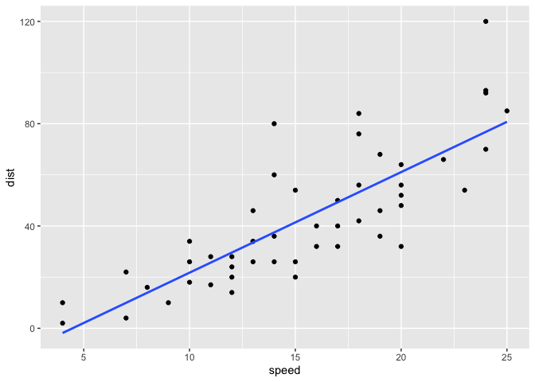
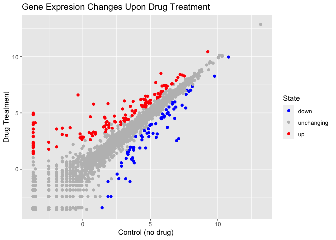

Class 5: Data Visualization
================
Eduardo

# Plotting in R

R has multiple plotting and graphics systems. The most popular of which
is **ggplot2**.

We has already played with “base” R graphics. This comes along with R
“out of the box”

``` r
plot(cars)
```


Compared to base R plots, ggplot is much more verbose - I need to write
more code to get simple plots like the one above

To use ggplot, I need to first install the ggplot2 package. To install
any package in R, I use the `intsall.packages()` command along with the
package name.

The Install is a one time only requirement. The package is now on our
computer. I don’t need to re-install it.

However, I can’t just use it without loading it up with a `library()`
call.

``` r
library(ggplot2)
```

``` r
ggplot(cars)
```


All ggplot figures need at least 3 things:

- data (this is the data.frame with our number and stuff)
- aesthetics (“aes”, how our data maps to the plot)
- geoms (do we want lines, points, columns, etc…)

``` r
ggplot(data = cars) + aes(x = speed, y = dist) + geom_point()
```


I want a trend line to show the relationship between speed and stopping
distance

``` r
ggplot(data = cars) + aes(x = speed, y = dist) + geom_point() + geom_line()
```


This is not what we want

``` r
ggplot(data = cars) + aes(x = speed, y = dist) + geom_point() + geom_smooth()
```

    `geom_smooth()` using method = 'loess' and formula = 'y ~ x'


To add a straight trend line use:

``` r
ggplot(data = cars) + aes(x = speed, y = dist) + geom_point() + geom_smooth(method = "lm", se=FALSE) 
```

    `geom_smooth()` using formula = 'y ~ x'



To store a plot and use it to edit u can use a variable

``` r
bb <- ggplot(data = cars) + aes(x = speed, y = dist) + geom_point() + geom_smooth(method = "lm", se=FALSE)
```

Now add labels using labs() and make it black and white using theme_bw()

``` r
bb + labs(title="Speed and Stopping Distances of Cars",
       x="Speed (MPH)", 
       y="Stopping Distance (ft)",
       subtitle = "Your informative subtitle text here",
       caption="Dataset: 'cars'") + theme_bw()
```

    `geom_smooth()` using formula = 'y ~ x'


Anti- Viral drug example

``` r
url <- "https://bioboot.github.io/bimm143_S20/class-material/up_down_expression.txt"
genes <- read.delim(url)
head(genes)
```

            Gene Condition1 Condition2      State
    1      A4GNT -3.6808610 -3.4401355 unchanging
    2       AAAS  4.5479580  4.3864126 unchanging
    3      AASDH  3.7190695  3.4787276 unchanging
    4       AATF  5.0784720  5.0151916 unchanging
    5       AATK  0.4711421  0.5598642 unchanging
    6 AB015752.4 -3.6808610 -3.5921390 unchanging

head(dataset) function will print the first few rows (6 by default) of
the data set

Find total number of genes (rows)

``` r
nrow(genes)
```

    [1] 5196

Find names of columns

``` r
colnames(genes)
```

    [1] "Gene"       "Condition1" "Condition2" "State"     

Find number of columns

``` r
ncol(genes)
```

    [1] 4

Summary of the “State” column

``` r
table(genes[,"State"])
```


          down unchanging         up 
            72       4997        127 

Fraction of genes up-regulated

``` r
127/5196
```

    [1] 0.02444188

Round it up to 2 sig figs and percent using round()

``` r
round( table(genes$State)/nrow(genes) * 100, 2 )
```


          down unchanging         up 
          1.39      96.17       2.44 

Graph the gene data as a scatterplot!

``` r
ggplot(genes)+ aes(x=Condition1, y=Condition2, color=State) + geom_point()
```


Make it easier to edit by storing plot in variable

``` r
p <- ggplot(genes) + 
    aes(x=Condition1, y=Condition2, col=State) +
    geom_point()
p
```


Add our own colors

``` r
p + scale_colour_manual( values=c("blue","gray","red") )
```


Add labels!

``` r
p + scale_colour_manual(values=c("blue","gray","red")) +
    labs(title="Gene Expresion Changes Upon Drug Treatment",
         x="Control (no drug) ",
         y="Drug Treatment")
```



Going Further Section:

``` r
# File location online
url <- "https://raw.githubusercontent.com/jennybc/gapminder/master/inst/extdata/gapminder.tsv"
library(dplyr)
```


    Attaching package: 'dplyr'

    The following objects are masked from 'package:stats':

        filter, lag

    The following objects are masked from 'package:base':

        intersect, setdiff, setequal, union

``` r
gapminder <- read.delim(url)
gapminder_2007 <- gapminder %>% filter(year==2007)
head(gapminder_2007)
```

          country continent year lifeExp      pop  gdpPercap
    1 Afghanistan      Asia 2007  43.828 31889923   974.5803
    2     Albania    Europe 2007  76.423  3600523  5937.0295
    3     Algeria    Africa 2007  72.301 33333216  6223.3675
    4      Angola    Africa 2007  42.731 12420476  4797.2313
    5   Argentina  Americas 2007  75.320 40301927 12779.3796
    6   Australia   Oceania 2007  81.235 20434176 34435.3674

Life expectancy plot from data

``` r
ggplot(gapminder_2007) +
  aes(x=gdpPercap, y=lifeExp) +
  geom_point()
```


Making it clearer by changing the transparency

``` r
ggplot(gapminder_2007) +
  aes(x=gdpPercap, y=lifeExp) +
  geom_point(alpha=0.5)
```


Adding more variables

``` r
ggplot(gapminder_2007) +
  aes(x=gdpPercap, y=lifeExp, color=continent, size=pop) +
  geom_point(alpha=0.5)
```


``` r
ggplot(gapminder_2007) + 
  aes(x = gdpPercap, y = lifeExp, color = pop) +

geom_point(alpha=0.8)
```


``` r
ggplot(gapminder_2007) + 
  aes(x = gdpPercap, y = lifeExp, size = pop) +
  geom_point(alpha=0.5)
```


``` r
ggplot(gapminder_2007) + 
  geom_point(aes(x = gdpPercap, y = lifeExp,
                 size = pop), alpha=0.5) + 
  scale_size_area(max_size = 10)
```


``` r
gapminder_1957 <- gapminder %>% filter(year==1957)

ggplot(gapminder_1957) + 
  aes(x = gdpPercap, y = lifeExp, color=continent,
                 size = pop) +
  geom_point(alpha=0.7) + 
  scale_size_area(max_size = 10) 
```


``` r
gapminder_1957 <- gapminder %>% filter(year==1957 | year==2007)

ggplot(gapminder_1957) + 
  geom_point(aes(x = gdpPercap, y = lifeExp, color=continent,
                 size = pop), alpha=0.7) + 
  scale_size_area(max_size = 10) +
  facet_wrap(~year)
```


